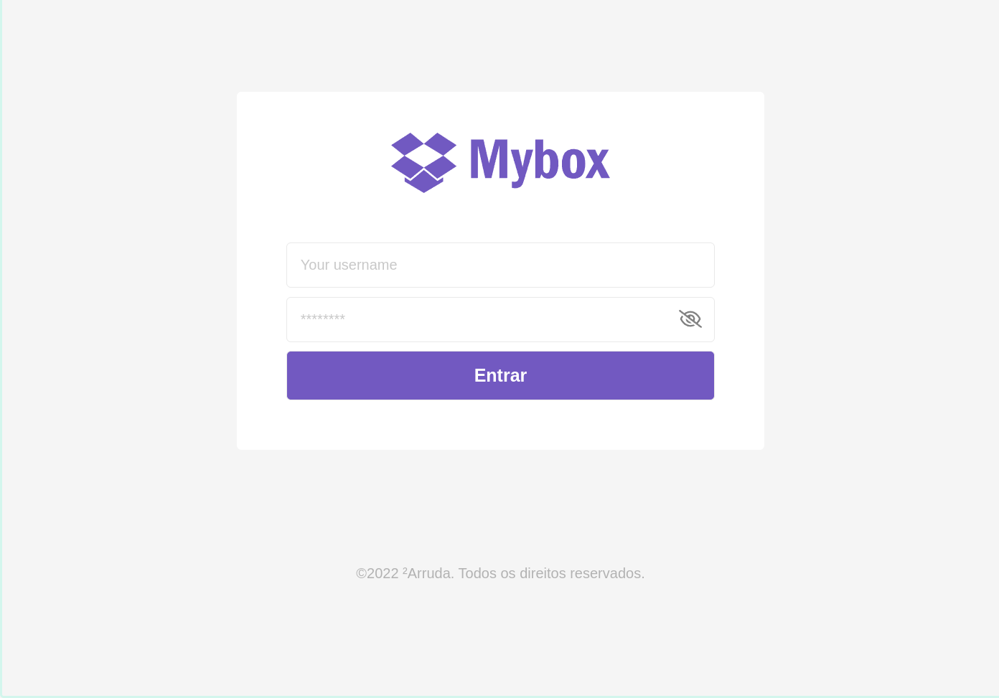
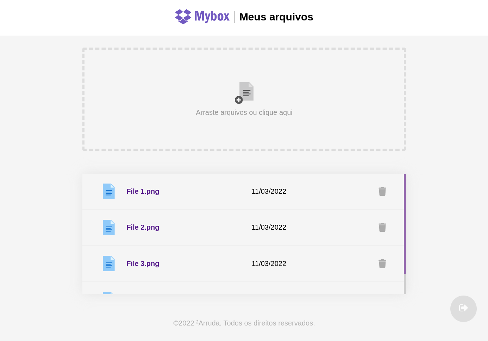

<h1 align="center">
    <a href="https://andrearruda-omnistack6.vercel.app/login" target="_blank">
        
    </a>
</h1>

<h4 align="center">
    Mybox
</h4>


<p align="center">
  <a href="#-tecnologias">Tecnologias</a>&nbsp;&nbsp;&nbsp;|&nbsp;&nbsp;&nbsp;
  <a href="#-projeto">Projeto</a>&nbsp;&nbsp;&nbsp;|&nbsp;&nbsp;&nbsp;
  <a href="#instalação">Instalação</a>&nbsp;&nbsp;&nbsp;|&nbsp;&nbsp;&nbsp;
  <a href="#telas">Telas</a>&nbsp;&nbsp;&nbsp;|&nbsp;&nbsp;&nbsp;
  <a href="#exemplo">Exemplo</a>
</p>


## 🚀 Tecnologias

Esse projeto foi desenvolvido com as seguintes tecnologias:

- [React.js](https://pt-br.reactjs.org/)


## 💻 Projeto
**Mybox é uma ferramenta parecida com o Dropbox feito na semana OMNISTACK 6 da Rocketseat. Nele é possível fazer upload e download de arquivos.**

## Instalação
### Pré requisitos
Ter instalado:
- [Node](https://nodejs.org/en/download/)
- [Yarn](https://classic.yarnpkg.com/en/docs/install/)

```sh
# Clonar repositório
git clone https://github.com/andre23arruda/mybox.git

# Instalar os pacotes do projeto
yarn install

# Run
yarn dev
```

## Telas
<div align="center">
    
</div>
<p align="center">Login</p>
<hr>

<div align="center">
    
</div>
<p align="center">Files</p>
<hr>


## Exemplo
<a href="https://andrearruda-omnistack6.vercel.app/login" target="_blank">Visitar</a>
